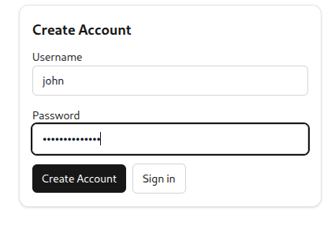
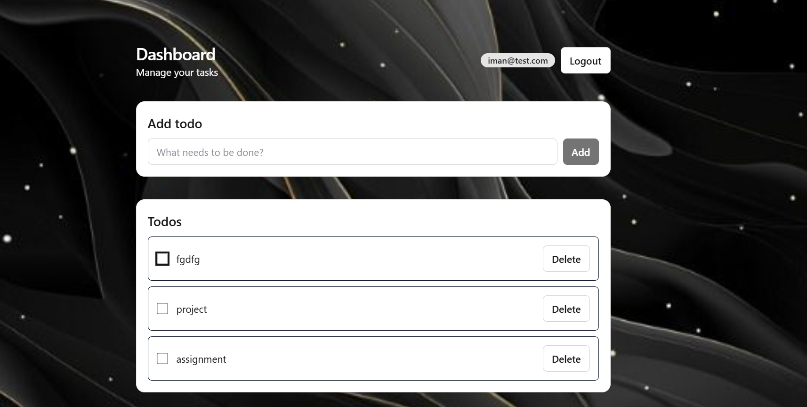

# Todo List (Java Servlet + React)

Full-stack Todo app with a Java Servlet backend and a minimal, responsive React frontend.

## Project Structure

- server/ — Java Servlet backend (runs at http://localhost:8080)
- client/ — Vite + React + TypeScript frontend

Frontend structure (client/):

- src/api — HTTP client
- src/store — Zustand stores (auth, todos)
- src/pages — Home, Login, Register, Dashboard
- src/lib — minimal router (Link + navigate/usePath)
- src/components/ui — shadcn-style primitives (Button, Card, Input, etc.)

## Backend

- Tech: Java Servlet (Jakarta), JSON API, JWT auth
- Base URL: http://localhost:8080/api

Endpoints:

- POST /auth/register
  - body: { "username": "fuad", "password": "password123" }
  - 201: { "id": 1, "username": "fuad" }
- POST /auth/login
  - body: { "username": "fuad", "password": "password123" }
  - 200: { "id": 1, "username": "fuad", "token": "<jwt-token>", "message": "user successfully logged in" }
- GET /todos (Bearer <token>)
  - 200: [ { "id": 6, "title": "Sleep", "completed": false, "userId": 1 } ]
- POST /todos (Bearer <token>)
  - body: { "title": "Sleep" }
  - 201: { "id": 6, "title": "Sleep", "completed": false, "userId": 1 }
- PUT /todos/:id (Bearer <token>)
  - body: { "completed": true }
  - 200: { "success": true }
- DELETE /todos/:id (Bearer <token>)
  - 204: No Content

Run backend (generic):

- Ensure Java 17+ and Maven installed
- Build: mvn clean package
- Deploy WAR to Tomcat/Jetty or start your servlet runner
- Verify at http://localhost:8080/api

## Frontend

Tech:

- Vite + React + TypeScript
- Tailwind CSS
- shadcn-style components
- Zustand state

Setup:

```bash
cd client
npm i
npm i class-variance-authority @radix-ui/react-slot
```

Dev:

```bash
npm run dev
# open http://localhost:5173
```

Build:

```bash
npm run build
npm run preview
```

Lint:

```bash
npm run lint
```

## Integration Details

- API client: client/src/api/client.ts
  - Uses base http://localhost:8080/api
  - Handles register, login, list/create/update/delete todos
- Auth store: client/src/store/auth.ts
  - Saves { user, token }, exposes login/register/logout
- Todos store: client/src/store/todos.ts
  - Uses token as Bearer, CRUD ops
- Routing:
  - Public: / (Home), /login, /register
  - Protected: /dashboard (redirects to /login if no token)
  - Link component: client/src/lib/router.tsx
  - navigate/usePath: client/src/lib/router-utils.tsx

## UI Behavior

- Home: centered, minimal headline/subtext, “Get started” + “Sign in”
- Login/Register: single-column card, full-width inputs, loading/disabled
- Dashboard: card list, touch-friendly controls, muted completed todos, skeletons

## Troubleshooting

- CSP errors often come from browser extensions; try Incognito
- Fast Refresh: component files only export components; move utilities to separate files
- Clear Vite cache:

```bash
rm -rf client/node_modules/.vite
npm run dev
```

## Screenshots

### Home


### Auth



### Dashboard

